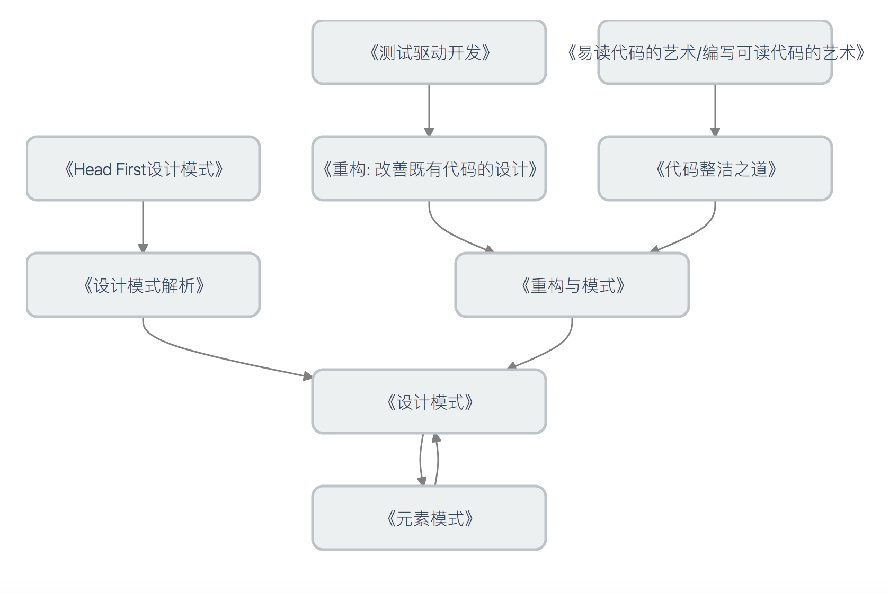
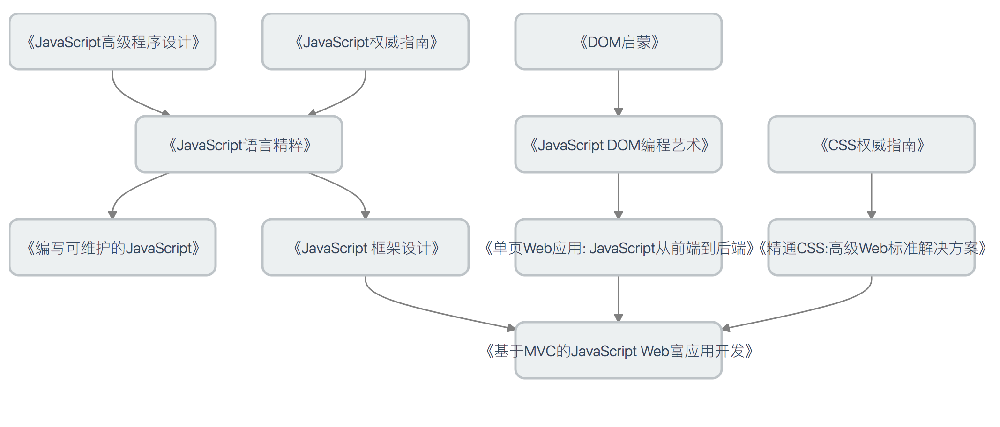
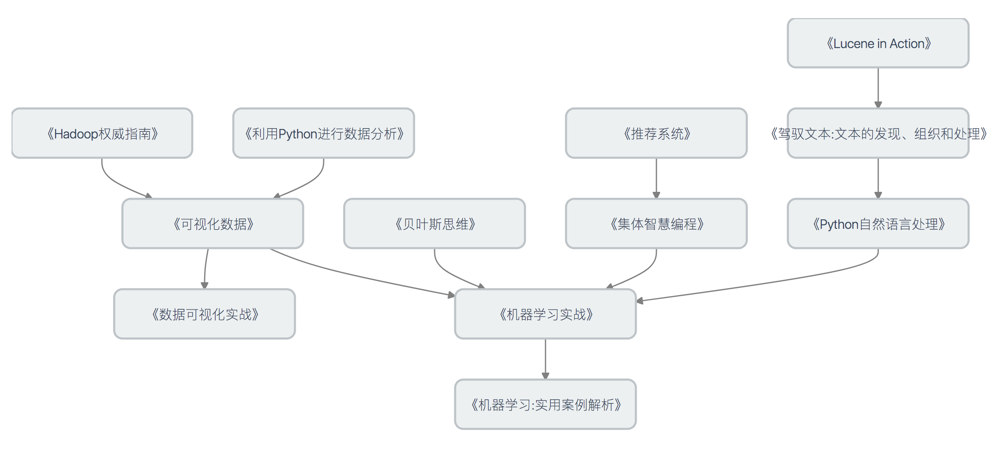
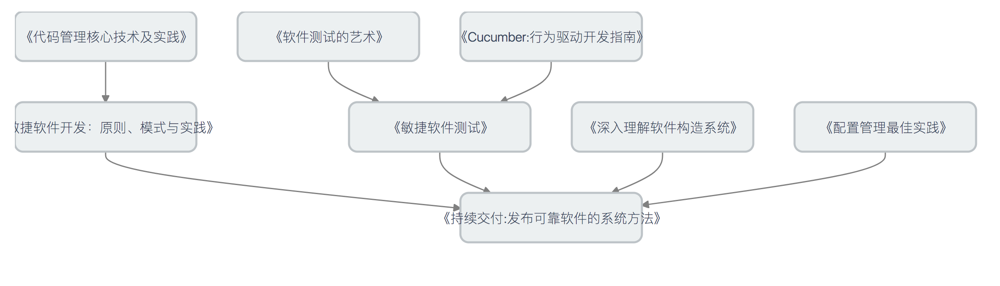
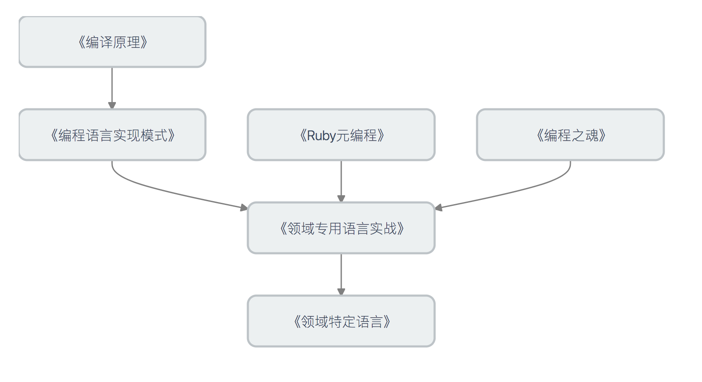
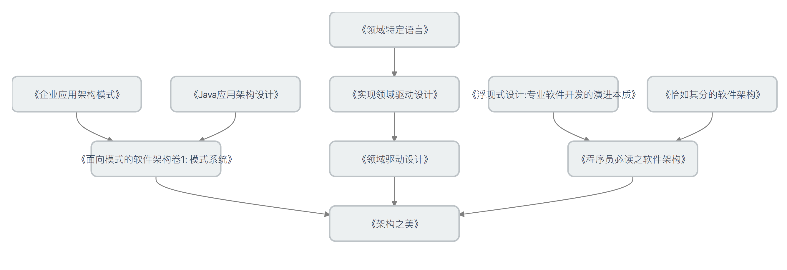

# [Developer](https://github.com/phodal/developer)进阶书单

成长路线已经汇集到Growth，Github见：[https://github.com/phodal/growth](https://github.com/phodal/growth)

> 这是一份关于如何[Re-Practise](https://github.com/phodal/repractise)的技术书籍推荐书单。

一直画/写一个推荐书单来供大家参考，无奈找不到一本合适的形式。有一天，想到了之前的技术树 [https://github.com/phodal/sherlock](https://github.com/phodal/sherlock)，便开始落地了。

在线查看见：[http://phodal.github.io/booktree/](http://phodal.github.io/booktree/)

我深知自己的知识有限，所以写下本文以便和大家切磋交流。欢迎通过 GitHub 的Issues或者直接Pull Requests方式来分享你的经验。期待你的反馈。

基本阅读路线图:


首先，你需要选择一门语言，然后学习之。这时有一些还不错，如JavaScript实战，JavaScript Cookbook，前者是一门实站手册，后者则是参考手册。再来一本某某语言，或者框架的实战，与权威指南，你就可以完成工作了。

然后呢？

**说明**: 完成工作是一件很容易的事，如何更好地完成工作就需要更多地学习。并且我坚信每一个有技术热情的人，都希望可以看到自己写的框架可以无处不在。

### 《技术的本质》 - W. Brain Arthur早已看穿了一切

这是一本关于『技术是什么，它是如何进化』的书。新的技术是根据于我们当前的目的、一个可实现的原理、一种新现象而发明的。并且，新的技术都是基于之前的技术发展出来的。

So，通过研究现有技术的一些发展，我们可以预料到一些新的技术的出现。尽管新的技术并没有解决一些根本性问题，如业务，但是它是为了业务而简化现有的技术。

### 如何写好代码——重构与设计模式

从编写可读的代码，到重构现有的代码，再到设计模式，是编码的必备法则。



 - 《测试驱动开发》: 尽管在国内，我们很少听到开发人员写测试，就更少听人们谈论TDD。虽然我不是TDD的死忠，但是我觉得TDD还是很有好处的。特别是当你的函数特别长的时候，它可以驱使你写出更短的函数——更多的函数。红->绿->重构，就是这么简单。
 - 《重构: 改善既有代码的设计》: 红->绿->重构。如果重构之前没有测试，我相信你可能是想换个工作了。好的代码是重构出来的，而不是一开始就写出来的——除非你的代码不用于任何业务。反正，就是程序员必读，不想多说。
 - 《Head First设计模式》: GoF的《设计模式》一书很薄，所以也很抽象。第一次看《设计模式》的时候，硬着头皮看了几天，然后放弃了。。。不过，Head First系列可以将各种枯燥的设计生起起来，这是一本非常适合入门设计模式的书籍没有之一。
 - 《设计模式解析》: 比Head First更深入，但是比DP简单。作者选用了一些常用或者说用到的模式，讲述了为什么在这里适合用它。
 - 《易读代码的艺术/编写可读代码的艺术》: 纳尼！你居然不想买这本书？
 - 《代码整洁之道》: 书中给了很方法与规范，遵循它们可以写出整洁的代码。但是整洁并不意味着你应该让代码简单！
 - 《重构与模式》: 这本书的中文名字应该叫《重构到模式》！！！重构代码到设计模式就这么简单。
 - 《设计模式》: 必读，并且值得多读几遍。
 - 《元素模式》: 首先书名很扯！！！这本书更适合叫《设计模式要素》!这本书提取了设计模式中的一些基本元素，很具有启发性。

### 如何写前端框架——前端读书路线图

以JavaScript作为例子来解释如何去学习一门语言，从语法到最后的MVC。



本图已被《JavaScript 框架设计：第 2 版》收录。

### 机器学习读书路线

机器学习依赖于大量的数据和理论知识，而数据又可以创造出美妙的数据可视化图像。




### 持续交付读书路线图

敏捷是过去，持续交付是现在，未来呢？

想要构建一个好的项目，构建系统、自动化测试、可配置缺一不可。



### 领域特定语言读书路线图

最好的语言就是可以表达你业务的语言。

如果你熟悉前端的知识的话，你会发现DSL无处不在。



### 架构与模式读书路线图——每个人都是架构师。

成为架构师最简单的方法就是学习别人的模式。

成为成功架构师便是创建模式。




## Contribute

书的数据代码位于``app/data``目录:
 
 - arch.json 架构
 - cd.json   持续交付
 - code.json 更好的代码
 - frontend.json 前端 
 - lang.json  语言
 - ml.json   机器学习
 
基本格式如下:

```javascript
{
  "id": 1,
  "description": "尽管在国内，我们很少听到开发人员写测试，就更少听人们谈论TDD。虽然我不是TDD的死忠，但是我觉得TDD还是很有好处的。特别是当你的函数特别长的时候，它可以驱使你写出更短的函数——更多的函数。红->绿->重构，就是这么简单。",
  "title": "《测试驱动开发》",
  "depends": [
    2, 3
  ]
}
```

字段说明:

 - ``id``用于寻找依赖用的
 - ``description`` 书籍的简单书评
 - ``title`` 书名
 - ``depends`` 依赖,数组,可多个

### License

© 2015 [Phodal Huang](http://www.phodal.com). See `LICENSE.txt` in this directory.

[待我代码编成，娶你为妻可好](http://www.xuntayizhan.com/person/ji-ke-ai-qing-zhi-er-shi-dai-wo-dai-ma-bian-cheng-qu-ni-wei-qi-ke-hao-wan/)
